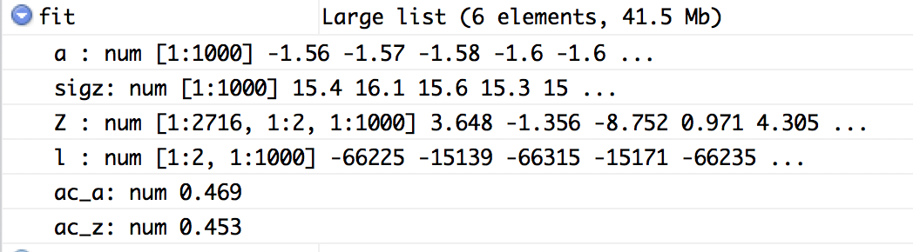

```{r setup, include=FALSE}
knitr::opts_chunk$set(echo = TRUE)
```

##Problem 1 using VBLPCM

Data cleaning and pick area to be Flagstaff:

```{r message=F}
library(readr)
library(network)
library(igraph)
data=read.table(file = '/Users/Mengjie/Downloads/ICPSR_22140/DS0002/22140-0002-Data.tsv', sep = '\t', header = TRUE,fill=TRUE)
data_Flagstaff <-subset(data, STUDYNUM==4)
data_Flagstaff <- subset(data_Flagstaff,select=c("ID1","ID2","RACE1","RACE2","AGE1","AGE2"))
data_Flagstaff=data_Flagstaff[!duplicated(data_Flagstaff[c("ID1","ID2")]), ]
g_Flagstaff <- graph_from_data_frame(data_Flagstaff[c("ID1","ID2")],directed = F)
network_Flagstaff <- network(x = get.edgelist(g_Flagstaff), matrix.type="edgelist", directed=FALSE)

IDs=as.numeric(network.vertex.names(network_Flagstaff))
race=numeric(length(IDs))
age=numeric(length(IDs))
for (i in 1:length(IDs)){
  if (IDs[i]%in% data_Flagstaff$ID1){
    race[i]=data_Flagstaff$RACE1[i]
    age[i]=data_Flagstaff$AGE1[i]
  }else{
    race[i]=data_Flagstaff$RACE2[i]
    age[i]=data_Flagstaff$AGE2[i]
  }
}

network::set.vertex.attribute(network_Flagstaff, "Race", race) 
network::set.vertex.attribute(network_Flagstaff, "Age", age) 
```

Fitting the model with 3 clusters and see latent plots and BIC score:

```{r message=F, cache=T}
library(VBLPCM)
v.start<-vblpcmstart(network_Flagstaff,G=3,LSTEPS=1e3)
v.fit<-vblpcmfit(v.start,STEPS=20)
plot(v.fit, main="Flagstaff")
summary.vblpcm(v.fit)
```

##Problem 2

First Run `R CMD SHLIB lf.c` in your terminal to compile C code so you will get *lf.so* file.

Next replace line 21 of `pilot_new.r` with 

`fit_ergm=ergmm(Y1~euclidean(d=k),control=ergmm.control(sample.size=1000,interval=20,burnin=0),verbose=2,tofit="mcmc")`

since the latest version of latentnet uses `euclidean()`.

```{r, eval = FALSE}
dyn.load("lf.so")
library(mvtnorm)
library(latentnet)

Y=dget("PPI")

source("pilot_new.r")
source("mcc.r")

fit0=latent.pilot(Y)
dput(fit0,"fit0")

fit=latent.mcc(Y,fit0,nsave=1000,nthin=20)
dput(fit,"fit_mcc")
```

After the model finishes, you will see the `fit` variable in your environment in RStudio



Use `fit$Z` to extract the latent positions for example.


##Fit Flagstaff using ergm

```{r message=F}
library(ergm)
fit <- ergm(network_Flagstaff~gwdegree(0.1)+ gwesp(0.5,fixed=T)+nodematch("Race")+nodecov("Age"))
summary(fit) 
```


